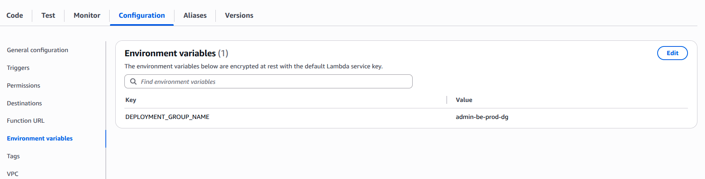
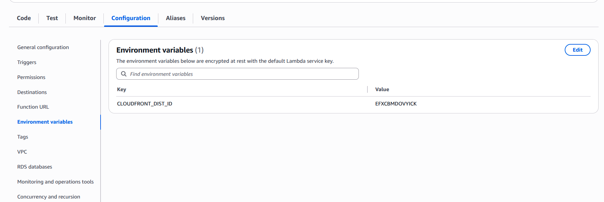

# Lambda Functions
Details about all functions!!

## deploymentfail-deleteASG.py
Delete ASG when Blue-green Pipeline failed,   

- In lambda function goes --> Configuration --> Enviroment variable and add below enviroment variable,

|  Key       | Value          |
|----------------------|----------------------|
| `DEPLOYMENT_GROUP_NAME`        | Your_deployment_grp_name    |

- ie.

## cloudfront-invalidation-pipeline.py
Invalidate Cloudfront in AWS Code Pipeline,   

## assets-s3-cloudfront-invalidation.py
This is for Assets S3 bucket when we put cludfront above S3 assets, This invalidate in cloudfront when new images push in bucket,   

- In lambda function goes --> Configuration --> Enviroment variable and add below enviroment variable,

|  Key       | Value          |
|----------------------|----------------------|
| `CLOUDFRONT_DIST_ID`        | Your_cloudfront_dist_id    |

- ie.

